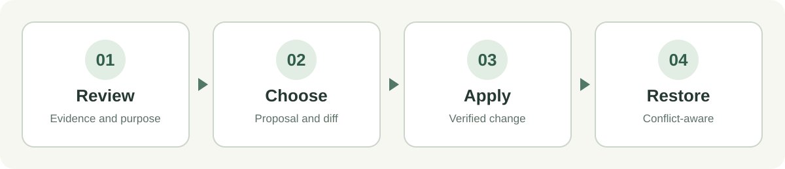

<p align="center">
  
</p>

<h1 align="center">Prune · 让技能保持有用</h1>

<p align="center">按真实任务审阅 AI skills，把取舍与文件差异放进本地工作台，由你决定是否应用。</p>

<p align="center">
  <a href="README.en.md">English</a> ·
  <a href="https://github.com/facadefish/prune-skill/releases/latest">下载中英文完整包</a> ·
  <a href="LICENSE">Apache-2.0</a>
</p>

> **一句话理解：** Prune 会帮 Agent 找出值得保留、需要改写或适合停用的指令；它把依据、候选和差异交给你审阅。只有你在工作台选择并点击 **应用所选**，真实文件或受支持的插件配置才会改变。

## 你会得到什么

| 能力 | 实际作用 |
| --- | --- |
| 按任务判断 | 结合你的目标、模型与宿主，检查技能的增量价值、触发边界、重复流程和依赖；不按长度或关键词给技能打分。 |
| 看得见的选择 | 技能树和裁剪台展示原文依据、建议、完整候选、文件差异及每项执行状态。报告只是补充。 |
| 可恢复的文件操作 | 对独立技能和规则文件冻结方案、核对原件指纹、备份、应用，并在没有冲突时恢复。 |
| 完整插件管理 | 把插件当作一个对象审阅；仅在宿主支持时经官方接口启停整个插件，不改插件内部文件。 |



## 3 分钟开始

**要求：** Node.js **22.19+**，支持本地 skills 的 Agent，以及本机浏览器。Prune 本身没有 npm 运行依赖、不需要模型 API key，也不向云端发送评审内容。语义判断由使用它的 Agent 完成；内置脚本负责冻结方案和执行工作台操作。

1. 从 [Releases](https://github.com/facadefish/prune-skill/releases/latest) 下载 `prune-zh.zip` 或 `prune-en.zip`。两者都是完整包，**只安装一种语言**。解压后应得到 `prune/SKILL.md`、`prune/scripts/`、`prune/references/`、`prune/assets/`、`prune/agents/`，以及许可文件 `LICENSE`、`NOTICE`。
2. 把整个 `prune/` 文件夹放到宿主的个人 skills 目录：

   | 宿主 | macOS / Linux | Windows |
   | --- | --- | --- |
   | Codex | `~/.agents/skills/prune/` | `%USERPROFILE%\.agents\skills\prune\` |
   | Claude Code | `~/.claude/skills/prune/` | `%USERPROFILE%\.claude\skills\prune\` |

   安装位置依据 [Codex 官方文档](https://learn.chatgpt.com/docs/build-skills)和 [Claude Code 官方文档](https://code.claude.com/docs/en/skills)。如果已有同名技能，请先备份旧目录，再替换整个文件夹；不要把两个版本混在一起。宿主未发现新技能时，重启会话。
3. 告诉 Agent：

   > 使用 $prune 审查我指定的 skills，结合当前任务给出保留、修改或停用建议，并在修剪工作台展示依据和差异，供我选择。

   只要求审查时，Prune 不写入受评原件。要求实际改写时，Agent 会先准备可审阅的完整候选；你仍须亲自在工作台选择并应用。

### 先试演示，不碰你的技能

在仓库根目录运行：

```text
node skills/prune/scripts/prune.mjs demo --out .prune-demo
node skills/prune/scripts/prune.mjs serve --run .prune-demo/run
```

打开第二条命令输出的**完整本地链接**。演示只使用 `.prune-demo/` 中生成的临时对象；可以试点建议、差异、应用和恢复。结束服务按 `Ctrl+C`。不要公开完整链接，其中包含本地会话令牌。

## 工作方式

```text
你的任务 + 受评技能/规则/插件
          ↓  Agent 语义审阅、准备候选
冻结方案：原文依据 + 指纹 + 可执行变更
          ↓  本地 Prune 工作台
你选择 → 应用所选 → 文件/宿主读回核验 → 按需恢复
```

Agent 可用 `prepare --input <方案.json> --out <新工作目录>` 冻结方案，再用 `serve --run <工作目录>` 打开工作台。详细字段和操作边界见[执行契约](skills/prune/references/contract.md)。运行目录应放在技能发现范围和公开仓库之外，并与待归档技能位于同一文件系统。方案改变要生成新版本；旧方案的选择不会自动授权新文件。

**状态要分开看：** 建议被采纳、文件或宿主配置已核验、当前模型会话已重新加载，是三件不同的事。页面不会把“已点击”显示成“已生效”。

## 平台与边界

- **操作系统：** 运行时使用 Node.js 标准库，目标平台为 Windows、macOS、Linux。Windows 与 Linux 的本机测试已通过；macOS 尚待 CI 验证。文件系统、符号链接和宿主配置可能因机器而异；请以实际读回状态为准。
- **宿主：** 核心技能审查与工作台不依赖 Codex 或 Claude Code 的插件 CLI。插件启停只在受支持的宿主/作用域开放：Codex 用户层本地插件；Claude Code 的 user、project、local 插件。接口不可用或目标无法唯一确认时，保留建议而不假装执行。
- **本地性：** 工作台只监听 `127.0.0.1`，使用随机端口和运行目录里的令牌。无遥测、无自动上传、无常驻服务。真实审阅输入、历史记录和令牌不包含在仓库或发布包中。
- **权限：** 准备方案不等于授权修改。只有用户对当前冻结方案的选择和 Apply 才能触发真实写入；Restore 同样由用户操作。不支持插件卸载、更新或内部改写。
- **证据：** 测试验证操作与恢复，不证明某个技能一定提高模型效果；插件配置读回也不证明当前会话已热加载。

## 开发与发布

中文完整包在 [`skills/prune/`](skills/prune/SKILL.md)；英文指令源在 [`locales/prune/en/`](locales/prune/en/SKILL.md)，与中文共用运行时。发布脚本从这两处构建两个独立包，不会把历史材料带进技能包。

```text
npm run check
node scripts/package-prune.mjs .release/local
```

检查包含公开内容扫描与临时对象的工作台测试；官方宿主插件接口的隔离集成测试需在装有相应宿主的环境单独启用。`packages.json` 只记录相对包路径及文件指纹。

欢迎提交能复现的缺陷和精简建议；请勿把真实方案、令牌、私有技能内容或本机路径贴到公开 Issue。安全问题见 [SECURITY.md](SECURITY.md)。

基于 Apache-2.0 许可发布。Prune 是独立社区技能，不隶属于 OpenAI 或 Anthropic。
